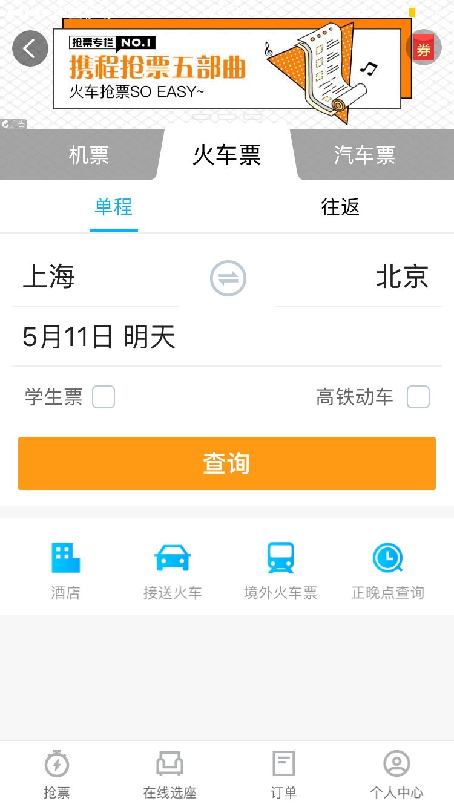
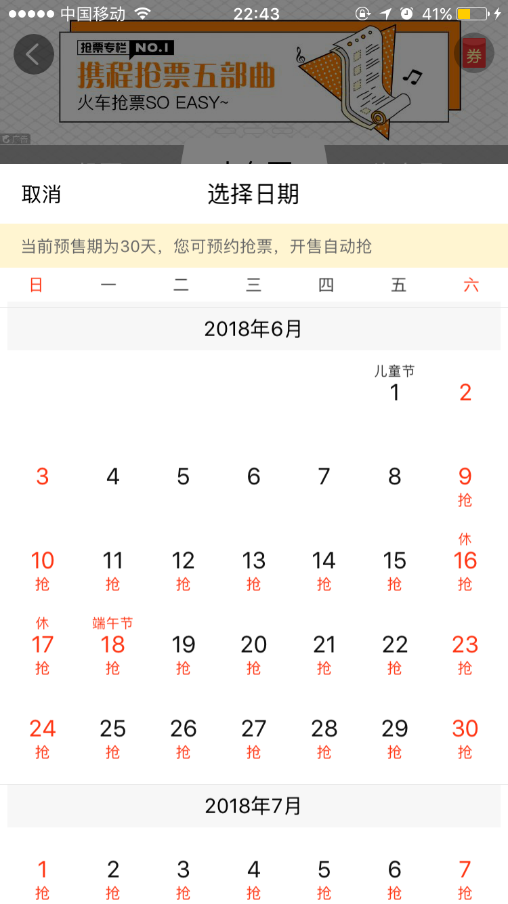
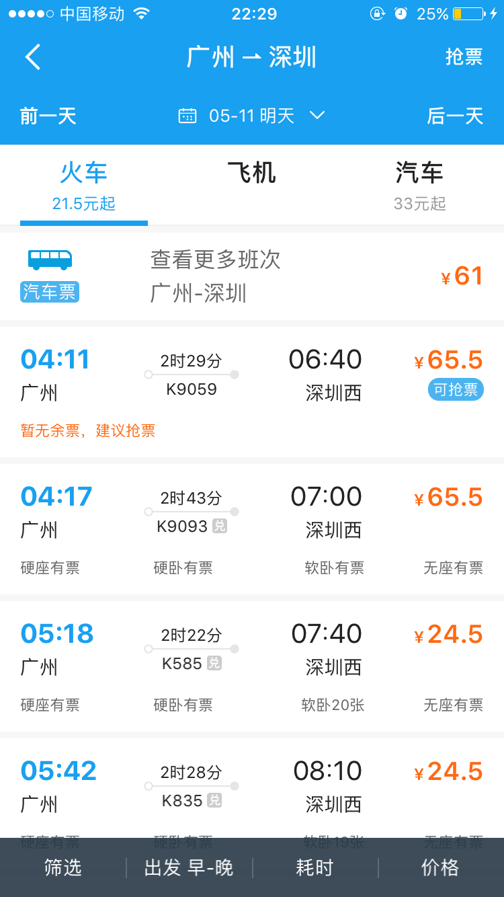
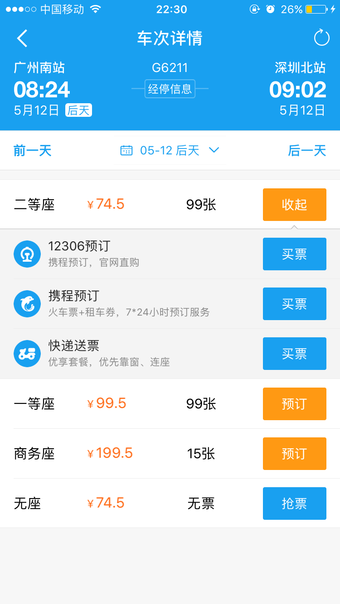
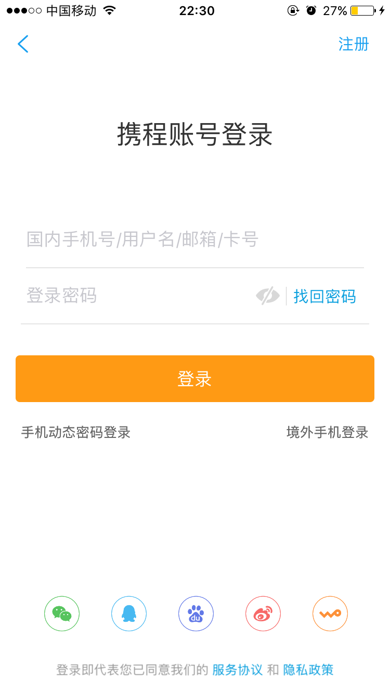
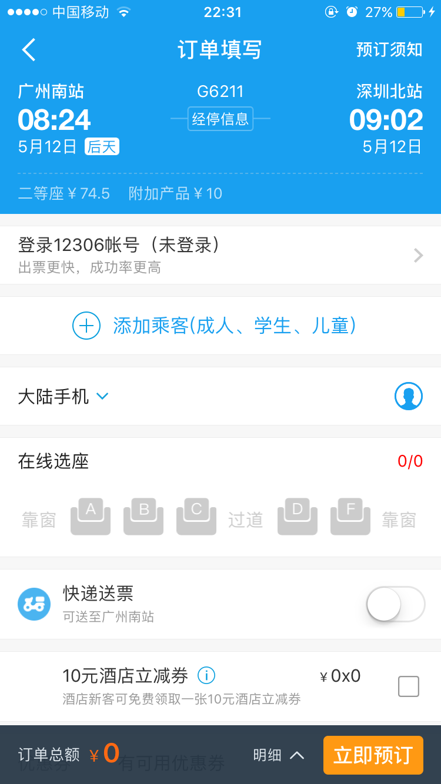
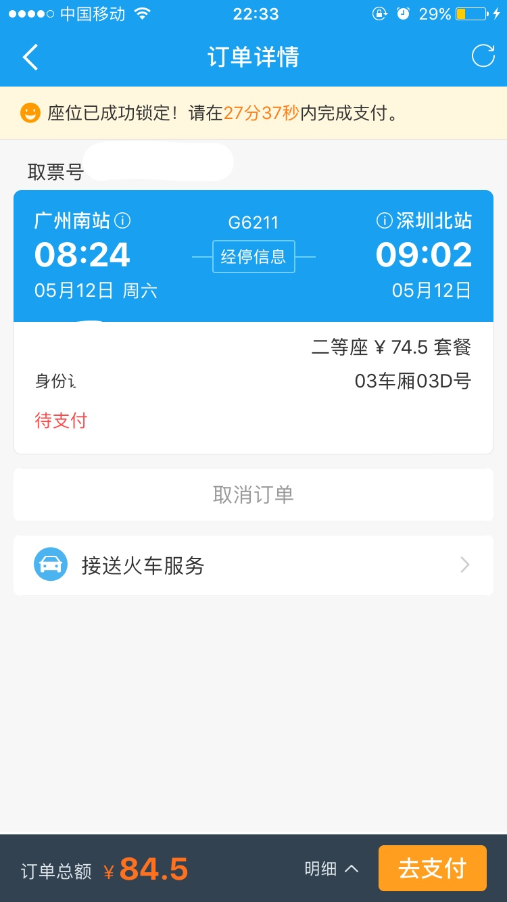
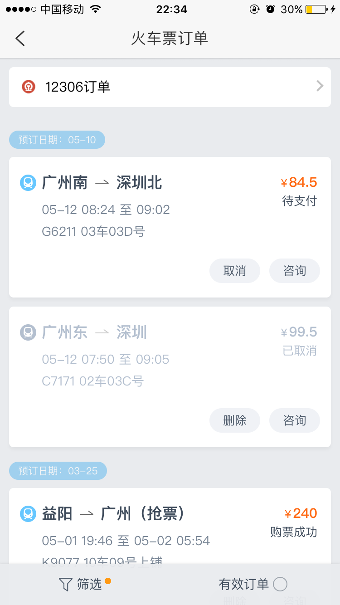
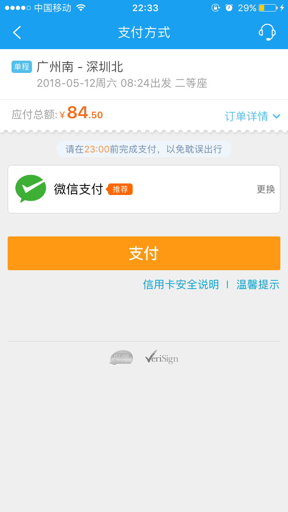
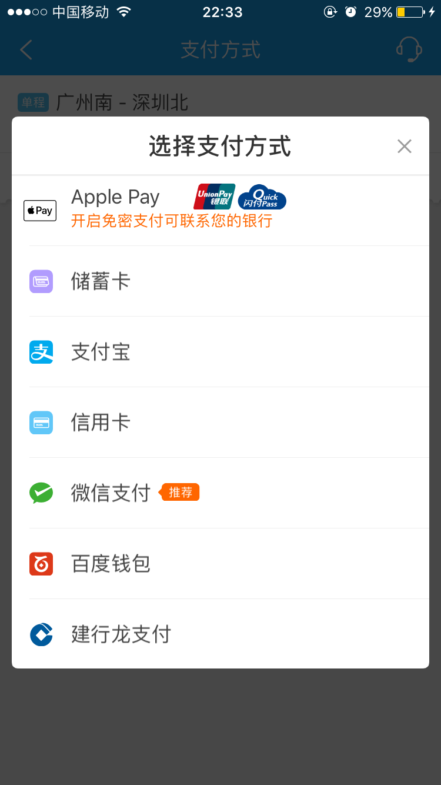

# 携程火车票预订文档

文档是关于网购火车票的移动应用。该应用的名称为“携程旅行”，我们关注的业务是携程的火车票预定。该应用是在携程旅行App系统功能能够实现的前提下实现的。如需进一步了解详情，请访问下载携程旅行。下面展示的截图将展现携程旅行APP在预订火车票上的功能性需求和约束。

## Screenshot 1
屏幕截图1表明, "预订火车票" 是一个更大的基于网络的解决方案的一部分, 为各种旅行方式预订和安排。从 "预订火车票" 的观点来看, 这些都应视为外部功能, 不依赖 "预订火车票"。
屏幕截图1首先要求客户可以选择预订单程或者往返的火车票，默认情况下是单程的火车票。
客户被要求在出发城市和到达城市键入, 选择出发日期, 可以选择只搜高铁动车（限定了车型）和学生票的特殊种类。"查询" 按钮允许向系统提交请求, 以便在指定日期查找可乘坐的特定班次的火车。

## Screenshot 2
在出发城市和到达城市栏，可以通过点击热门城市或者字母序列查找点击，也可以通过中文拼音简拼输入。

## Screenshot 3

在选择出发日期时，点击后出现图中出现的选择框，火车预售期仅为30天，如果超出预售期的车票，需要预约抢票。

# Screenshot 4

在截图1输入相应的信息发出请求后，得到截图4的响应。首先，显示客户预订火车票的出发城市、到达城市、火车票种类（单程等），出发日期。然后日期栏方便客户选择更改日期附近的车次，还有可以应用底部可以根据不同的条件进行车次筛选，页面主要部分显示各个车次的信息，包括车次号，出发和到达时间，出发站和到达站，运行时长，各种坐席的余票和最低的价格，可抢票的按钮出现意味着该车次所有的票均已售完。

# Screenshot 5

点进一个车次。

上面显示了该车次所有坐席的种类、对应的价格和余票，点下预订按钮，会有三种买票方式，一种是12306预订，一种是携程预订，另外一种是快递送票。

# Screenshot 6
点击携程预订

需要登陆携程账号才可以继续完成预订火车票。

# Screenshot 7
登陆完成后，进入了截图7。

车次信息：显示了关于客户预订车次的具体信息，包含单程、车次号、出发站、出发时间、运行时长、到达站、到达时间、坐席类别和价格，还有预订须知的链接。
经停信息：点击经停信息按钮，会显示该车次运行区间的经停站点和时间信息。
乘客信息：因为我国是需要凭身份证乘坐火车的，所以，乘客需要在下订单的时候填写自己的身份信息。
取票方式：客户需要填写自己的联系方式，方便取票。
免费选座：在条件允许的情况下，客户可以免费选择自己喜欢的坐席。
取票方式：不选择快递送票则默认为自助取票。
其他广告产品：客户根据自己需求选择
订单总额和明细：显示所有费用之和
立即预订按钮：完成订单填写步骤

# Screenshot 8
点击立即预订的按钮后，出现订单详情。有取消订单的按钮和去支付的按钮。如果点击去支付的按钮，那么订单的流程就会继续进行。

# Screenshot 9
此时不继续进行进一步操作，查看订单：

此时订单状态显示待支付，而如果点击取消订单，订单状态就会变成已取消，如果订单完成，火车票预订成功，订单状态就会更改为购票成功。

# Screenshot 10
在截图8时点击去支付按钮。

支付页面会显示需要支付的金额，车次的简要信息和订单详情，支付方式推荐微信支付，点击更换后，出现了：

客户可以自由选择支付方式。
支付后，等待携程出票。出票后，携程发短信通知出票成功。
